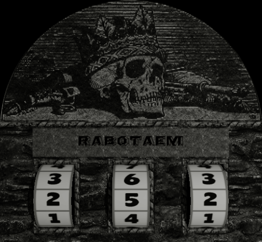

# SlotMachine3D
3D slot-machine. Made in [three.js](https://threejs.org/)



## Demo

Run `npm ci && npm run demo` to see the demo in action.  
All this demo code is located in [demo](demo) directory.  

## Usage

Code from demo examle:  
```js
var slotMachine = new SlotMachine3D({
  renderContainer: renderContainer, // HTML Element
  numbersRollTextureURL: '/number-roll.png',
  slotTextureURL: '/slot.png',
  backgroundHexColor: 0x000000, // Optional
  caption: 'RABOTAEM', // Optional
  font: 'Angles Octagon', // Optional. Default value: 'serif'
  fontSize: '40px', // Optional. Default value: '40px'
  fillStyle: '#020000', // Optional. Default value: '#020000'
  onSpinStart: onSpinStart, // Optional
  onSpinFinish: onSpinFinish, // Optional
  // Optional
  // sceneTemplate: {
  //   slot: {
  //     position: { x: 0, y: 0, z: 0 },
  //     scale: { x: 8.663900414937759, y: 8, z: 1 },
  //   },
  //   caption: {
  //     position: { x: 0, y: -0.7, z: 0.1 },
  //     scale: { x: 6.4, y: 0.9, z: 0.1 },
  //   },
  //   camera: {
  //     position: { x: 0, y: -0.9, z: 10.8 },
  //   },
  //   spotlight: {
  //     position: { x: 9, y: 0, z: 18 },
  //   },
  //   cylinders: [
  //     {
  //       position: { x: -2.48, y: -2.57, z: -0.57 },
  //       scale: { x: 1.11, y: 1.2, z: 1.11 },
  //     },
  //     {
  //       position: { x: 0, y: -2.57, z: -0.57 },
  //       scale: { x: 1.11, y: 1.2, z: 1.11 },
  //     },
  //     {
  //       position: { x: 2.48, y: -2.57, z: -0.57 },
  //       scale: { x: 1.11, y: 1.2, z: 1.11 },
  //     },
  //   ],
  // },
});

slotMachine.spin(123);
slotMachine.setCaption('Custom caption');

// Glitch effects
// slotMachine.enableGlitchSpinSlot();
// slotMachine.enableGlitchSpinCaption();

// slotMachine.disableGlitchSpinSlot();
// slotMachine.disableGlitchSpinCaption();

// slotMachine.setCameraShakeAmplitude(0.15);
// slotMachine.setCameraShakesPerSecond(15);
// slotMachine.enableCameraShake();
// slotMachine.disableCameraShake();

// slotMachine.setSpinConfig([
//   {
//     cycles: 1,
//     durationSeconds: 3
//   },
//   {
//     cycles: [1, 2],
//     durationSeconds: [3, 4]
//   },
//   {
//     cycles: [2, 3],
//     durationSeconds: [4, 5]
//   },
// ]);
```
